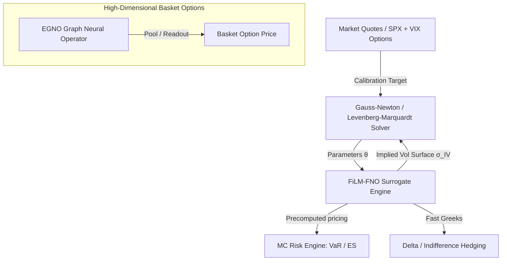

# Project Context: DeepVol Derivatives Pricing & Calibration Engine

DeepVol is an end-to-end, GPU-accelerated system for real-time calibration of stochastic and rough volatility models. It replaces expensive, traditional numerical pricers with high-performance neural operator surrogates (FiLM-FNOs), enabling calibration at interactive speeds (sub-millisecond pricing).

---

## 1. System Architecture & Data Flow



### Module Blueprint
- `src/deepvol/models/`: Contains exact numerical/stochastic engines (Heston, SABR, SSVI, Dupire Local Vol, Rough Bergomi, McKean-Vlasov SDE).
- `src/deepvol/surrogates/`: Neural network pricing architectures (Mirror-Padded FiLM-FNO, EGNO, Signature SDE, Neural SDE).
- `src/deepvol/calibration/`: Optimization solvers (vectorized Gauss-Newton, particle calibration, RKHS solvers).
- `src/deepvol/risk/`: Monte Carlo simulation engines for VaR, Expected Shortfall, and portfolio risk analysis.
- `src/deepvol/hedging/`: Indifference pricing, BSDE solvers, and delta hedging simulation loops.
- `src/deepvol/api/`: High-throughput WebSocket and REST APIs (FastAPI) utilizing conflated queue buffers.
- `src/deepvol/deploy/`: TensorRT compiler scripts and Kubernetes/Docker orchestration.

---

## 2. Mathematical Formulations (The Model Zoo)

DeepVol integrates 10 mathematical and neural models under a unified pricing and calibration interface:

### 1. Classic Heston Model
Stochastic volatility process where variance follows a Cox-Ingersoll-Ross (CIR) process:
$$dS_t = (r - q) S_t dt + \sqrt{v_t} S_t dW_t^1$$
$$dv_t = \kappa(\theta - v_t) dt + \sigma \sqrt{v_t} dW_t^2$$
Pricing is completed via the **Fourier-COS series expansion** utilizing Gatheral's stable characteristic function representation.

### 2. SABR Model (Hagan / Displaced)
Industry-standard stochastic volatility model for FX and interest rates:
$$dF_t = \alpha_t F_t^\beta dW_t^1, \qquad d\alpha_t = \nu \alpha_t dW_t^2, \qquad d\langle W^1, W^2\rangle_t = \rho dt$$
Displaced SABR replaces $F_t$ with $F_t + s$, allowing negative interest rate regimes.

### 3. SSVI (Surface SVI) Model
Parameterizes the entire implied volatility surface under Gatheral's SVI slices with strict calendar and butterfly no-arbitrage bounds enforced directly in parameter space.

### 4. Local Volatility (Dupire SVI) Model
Calculates state-dependent local volatility $\sigma_{\text{loc}}(T, K)$ using Dupire's formula via finite differences applied to the calibrated SSVI surface.

### 5. Rough Bergomi (rBergomi) Model
Lognormal rough volatility model driven by fractional Brownian motion:
$$v_t = v_0 \exp\left( \eta \sqrt{2H} \int_0^t (t-s)^{H-\tfrac{1}{2}} dW_s - \frac{1}{2} \eta^2 t^{2H} \right)$$
Solved on GPU using the Bennedsen-Lunde-Pakkanen (2017) hybrid convolution scheme (1D FFT).

### 6. Neural SDE
Data-driven generative pricing model where the drift and diffusion coefficients are parameterized by neural networks and calibrated via adjoint sensitivity paths.

### 7. Signature Volatility
Models path-dependency using rough path theory, representing asset volatility as a linear function of the truncated signature of historical prices:
$$d S_t = r S_t dt + \langle \mathbf{M}, \mathbb{X}_{0,t} \rangle S_t dW_t$$

### 8. McKean-Vlasov SDE (MLSV) Model
Local stochastic volatility model where the volatility coefficient depends on the marginal distribution of the spot process:
$$\lambda^2(K, t) = \frac{\sigma_{\text{Dup}}^2(K, t)}{\mathbb{E}[V_t \mid S_t = K]}$$
Solved using a particle system with Nadaraya-Watson kernel density estimation or RKHS Gaussian ridge regression.

### 9. Schwartz-Smith (2-Factor Commodity) Model
Captures short-term mean-reverting deviations and long-term equilibrium factors to model commodity futures curves and options.

### 10. LMM-SABR Model
Combines the Libor Market Model (LMM) with SABR stochastic volatility to model the evolution of interest rate forward curves and swaption cubes.

---

## 3. GPU Performance & Memory Optimization

To maximize throughput and prevent VRAM out-of-memory (OOM) failures on target hardware (RTX 3060 Laptop, 6.1 GB VRAM), the following rules are enforced:

### VRAM & Execution Rules
- **Double Precision (`float64`) pricing Layers**: BS pricing and Riccati solvers operate strictly in double precision to prevent gradient noise, then cast back to `float32` at the boundary.
- **Kernel Fusion via `torch.compile`**: Core loops (Euler SDE steps, bisection searches) use `@torch.compile(mode="reduce-overhead")` to enable Triton kernel fusion.
- **Static Buffer Guard**: compiled functions with `reduce-overhead` reuse static CUDAGraphs memory buffers. Output tensors must be cloned (`.clone()`) to prevent subsequent iterations from overwriting VRAM states.
- **Structure of Arrays (SoA)**: Path states (spot `S`, variance `V`, discount `D`) are represented as separate contiguous tensors rather than a single multi-column tensor, maximizing memory coalesced reads.

### EGNO PSD Eigendecomposition Profiling
Graph Neural Operators (EGNO) validation has been optimized based on performance sweeps:
- **N < 20 assets**: Eigendecomposition is negligible (~0.4 ms).
- **N = 50 assets**: Eigendecomposition adds significant overhead (~35 ms).
- **N = 100 assets**: Eigendecomposition adds critical overhead (~82 ms).
- **Optimization**: EGNO constructor features a `validate_psd` parameter (default `'auto'`). It automatically performs spectral PSD projection for $N < 50$ assets and skips it for $N \ge 50$ (logging a warning and delegating validation to upstream layers).

---

## 4. Verification & Production Command Reference

### Running the Test Suite
All modifications must pass the test suite cleanly:
```bash
# Run all tests (approx. 8 minutes, 955 tests)
uv run pytest tests/ -v --tb=short

# Run a specific module's tests
uv run pytest tests/test_egno.py -v
```

### Running the Calibration & API Services
To start the WebSocket conflated queue feed and the calibration FastAPI application:
```bash
# Start the production FastAPI server
uv run uvicorn deepvol.api.main:app --host 0.0.0.0 --port 8000 --workers 4

# Run the Streamlit live visualizer dashboard
uv run streamlit run app_frontend/main.py
```
