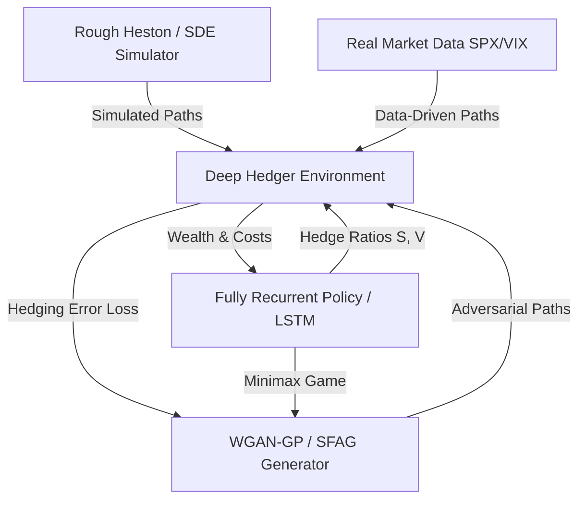

# Phase 6: Deep Hedging & Adversarial Market Generation — Technical Roadmap

This roadmap details the mathematical framework, reinforcement learning (RL) env architecture, generative models, and GPU-optimized training workflows for Phase 6 (P6) of the Neural Network Pricing Framework. The objective of Phase 6 is to implement a model-free, friction-aware, and robust hedging system that outperforms traditional Greeks-based hedging in realistic market settings.

---

## Roadmap Overview

Phase 6 is divided into three key work packages:
- **P6.1 — Deep Hedging for European Options under Rough Heston**: Hedging vanillas in a non-Markovian volatility regime, comparing learned neural policies against analytic and FNO-derived Greeks.
- **P6.2 — Deep Hedging for Exotic Options under Transaction Costs**: Hedging Down-and-Out Barrier Calls under proportional costs, learning optimal rebalancing boundaries (hedging bands) around the barrier.
- **P6.3 — Adversarial Market Generation**: Developing a Stylized Facts Alignment GAN (SFAG) and a robust minimax training loop to train the hedging policy against worst-case synthetic scenarios.



---

## P6.1 — Deep Hedging for European Options under Rough Heston

### 1. Mathematical Formulation
Let $(\Omega, \mathcal{F}, (\mathcal{F}_t)_{t=0}^T, \mathbb{P})$ be a filtered probability space. We consider a discrete trading grid $0 = t_0 < t_1 < \dots < t_N = T$ with time step $\Delta t = T / N$.
The hedging portfolio consists of $d \ge 1$ hedging instruments with price process $H_t = (H_t^1, \dots, H_t^d) \in \mathbb{R}^d$. In our baseline setup under stochastic volatility:
1. $H_t^1 = S_t$, the underlying stock price.
2. $H_t^2 = C_t^{\text{hedge}}$, a liquid short-maturity variance instrument (e.g., a vanilla option or VIX future) to manage volatility risk (Vega).

A trading strategy is a predictable process $\delta_t = (\delta_t^1, \dots, \delta_t^d) \in \mathbb{R}^d$ representing the holdings in the hedging instruments during the interval $(t_k, t_{k+1}]$.
The terminal wealth of the hedger, starting with initial capital $V_0$, is given by:
$$W_N = V_0 + \sum_{k=0}^{N-1} \delta_{t_k} \cdot (H_{t_{k+1}} - H_{t_k}) - \sum_{k=0}^{N} C_k(\delta_k - \delta_{k-1})$$
where $\delta_{-1} = 0$, and $C_k(\Delta \delta)$ is the transaction cost function at step $k$. Under proportional transaction costs:
$$C_k(\delta_k - \delta_{k-1}) = \sum_{i=1}^d c_i H_{t_k}^i |\delta_k^i - \delta_{k-1}^i|$$
where $c_i > 0$ is the proportional cost coefficient for instrument $i$.

Let $Z$ be the terminal payoff of a European option (e.g., $Z = (S_T - K)^+$). The net hedging error is:
$$HE = W_N - Z$$
The hedging objective is to find a policy $\pi_\theta$ parameterizing the strategy $\delta_{t_k} = \pi_\theta(\cdot)$ that minimizes the **Entropic Risk Measure** (equivalent to maximizing exponential utility):
$$L(\theta) = \mathbb{E}\left[ \exp\left(-\lambda (W_N - Z)\right) \right]$$
where $\lambda > 0$ is the risk aversion parameter. For quadratic hedging (variance minimization), we minimize:
$$L_{\text{quad}}(\theta) = \mathbb{E}\left[ (W_N - Z)^2 \right]$$

### 2. Neural Architecture: Fully Recurrent Policy
To hedge under the non-Markovian **Rough Heston** dynamics, the hedging policy must capture path dependencies. We implement a **Fully Recurrent Neural Network (fRNN)** / **LSTM** cell.
At each step $t_k$, the input state vector is:
$$X_k = \left[ \log\left(\frac{S_{t_k}}{K}\right), T - t_k, V_{t_k}, \delta_{t_{k-1}} \right]$$
where $V_{t_k}$ is the instantaneous variance (or the rolling VIX index), and $\delta_{t_{k-1}}$ is the previous position (to make the model cost-aware).
The policy updates its hidden state and outputs the new hedge ratios:
$$h_k = \text{LSTMCell}(X_k, h_{k-1})$$
$$\delta_{t_k} = \text{Linear}(h_k)$$
where $\delta_{t_k}$ is squashed via a tanh activation scaled by leverage limits if position limits are enforced.

```
       [S_k/K, T-t_k, V_k]
                |
                v
  h_{k-1} ---> [LSTM Cell] ---> h_k ---> [Linear + Tanh] ---> \delta_k
    ^             |                                                |
    |             v                                                |
    +-----[Hidden State Update]                                    |
    |                                                              v
  \delta_{k-1} --------------------------------------------> [Cost Calc]
```

### 3. GPU Path Simulation
We simulate training paths using the calibrated **Lifted Heston model** developed in Phase 5:
$$dV_t^{N, i} = -x_i^N V_t^{N, i} dt + \kappa (\theta - V_t^N) dt + \sigma \sqrt{V_t^N} dW_t^1$$
$$V_t^N = \sum_{i=1}^N c_i^N V_t^{N, i}$$
$$dS_t = \sqrt{V_t^N} S_t \left( \rho dW_t^1 + \sqrt{1-\rho^2} dW_t^2 \right)$$
Using PyTorch, paths are simulated in parallel:
- **Batch Size**: $M \ge 8192$ paths.
- **Time steps**: $N = 100$ or $252$ steps.
- The simulation is fully vectorized on GPU, using Euler-Maruyama stepping with a floor of $\epsilon = 10^{-4}$ on $V_t^N$ to ensure stability.

### 4. Baseline Comparison
The neural strategy $\delta_t$ will be benchmarked against:
1. **Analytic/FNO Greeks**: Hedging with $\delta_t = \Delta_{\text{FNO}} = \frac{\partial V_{\text{FNO}}}{\partial S_t}$.
2. **Black-Scholes Delta**: Standard BS delta $\Delta_{\text{BS}}$ calculated using rolling historical volatility.
3. **Whalley-Wilmott Strategy**: A classical asymptotic utility-maximizing strategy that defines a "no-transaction band" around the model-based delta.

---

## P6.2 — Deep Hedging for Exotic Options under Transaction Costs

### 1. Exotic Instrument: Down-and-Out Barrier Call
Barrier options present extreme hedging challenges because their Greeks are discontinuous or explode near the barrier. We hedge a **Down-and-Out Barrier Call (DOBC)**:
$$Payoff = (S_T - K)^+ \cdot \mathbb{I}\left( \min_{0 \le t \le T} S_t > B \right)$$
where $B < S_0$ is the lower barrier. If $S_t$ touches $B$ at any trading step $t_k$, the option knocks out and becomes worthless ($Payoff = 0$).

Near the barrier $B$, the option's Gamma ($\Gamma = \frac{\partial^2 V}{\partial S^2}$) changes sign and becomes extremely negative as volatility approaches maturity. Under transaction costs, standard delta hedging near the barrier leads to rapid rebalancing (hedging chattering), causing transaction costs to consume the portfolio value.

### 2. State Space and Barrier Boundary Features
To enable the network to learn smooth hedging bands near the barrier, we feed specific boundary features into the network state:
$$X_k^{\text{barrier}} = \left[ \log\left(\frac{S_{t_k}}{K}\right), \log\left(\frac{S_{t_k}}{B}\right), T - t_k, I_{t_k}, \delta_{t_{k-1}} \right]$$
where $I_{t_k} = \mathbb{I}\left( \min_{0 \le j \le k} S_{t_j} > B \right)$ is the indicator variable of whether the option is still active.
The policy must learn to:
1. Under-hedge (hold less stock than delta) when close to the barrier to avoid transaction costs if a knock-out is highly probable.
2. Formulate a **hedging corridor**: a dynamic no-transaction zone where the hedge is held constant unless the spot price moves outside the band boundaries.

### 3. Pathwise Payoff Evaluation on GPU
To train the model-free policy, the barrier condition is evaluated on the entire path tensor. Let $S \in \mathbb{R}^{M \times N}$ be the spot price paths.
1. Compute the running minimum of each path:
   $$S_{\text{min}} = \text{cummin}(S, \text{dim}=1)[0]$$
2. The active mask $I \in \mathbb{R}^{M \times N}$ is:
   $$I_{i, k} = \mathbb{I}(S_{\text{min}, i, k} > B)$$
3. The option payoff tensor $Z \in \mathbb{R}^M$ is:
   $$Z_i = \max(S_{i, N} - K, 0) \cdot I_{i, N}$$
All operations are executed in PyTorch, preserving differentiability back to $S$ for pathwise gradient methods if necessary, and allowing parallel evaluation.

---

## P6.3 — Adversarial Market Generation

### 1. Robust Deep Hedging via Minimax Game
Instead of training the hedger purely on paths from a fixed mathematical model (which suffers from model misspecification risk), we train it against an **adversarial market generator** in a zero-sum minimax game.
Let $G_\psi$ be a generative model (WGAN-GP or Diffusion) parameterizing the path distribution. The training objective is:
$$\min_{\theta} \max_{\psi} \left\{ \mathbb{E}_{S \sim G_\psi}[ \ell(-PL_T(S; \theta)) ] - \mu D_{\text{dist}}(G_\psi, \mathbb{P}_{\text{real}}) \right\}$$
where:
- $\theta$ are the parameters of the hedging policy $\pi_\theta$.
- $\psi$ are the parameters of the path generator $G_\psi$.
- $D_{\text{dist}}$ is a distance penalty (e.g. WGAN discriminator loss) keeping the generated paths realistic.
- $\mu > 0$ balances the path difficulty against realism.

In this minimax game:
1. The **Hedger** $\pi_\theta$ learns to hedge robustly against the generated paths.
2. The **Generator** $G_\psi$ learns to generate realistic market paths that maximize the hedging error of the current policy, automatically discovering "stress scenarios" (such as flash crashes or regime shifts).

### 2. Generative Backbone: WGAN-GP with Stylized Facts Constraints
We implement a **Stylized Facts Alignment GAN (SFAG)** to generate return paths $r \in \mathbb{R}^{M \times T}$ from latent noise $z \sim \mathcal{N}(0, I)$. The baseline objective combines the Wasserstein adversarial loss with a Gradient Penalty (WGAN-GP) to enforce training stability:
$$L_{\text{adv}} = \mathbb{E}[D_\phi(G_\psi(z))] - \mathbb{E}[D_\phi(r_{\text{real}})] + \lambda_{\text{gp}} \mathbb{E}\left[ (\|\nabla_{\tilde{r}} D_\phi(\tilde{r})\|_2 - 1)^2 \right]$$

To prevent mode collapse and guarantee that generated paths are financially meaningful, we add four **differentiable stylized fact losses** directly to the generator's objective:
$$L_{\text{gen}} = L_{\text{adv}} + \lambda_1 L_{\text{GPD}} + \lambda_2 L_{\text{ACF}} + \lambda_3 L_{\text{Lev}} + \lambda_4 L_{\text{CFVC}}$$

#### A. Differentiable Fat Tails Loss ($L_{\text{GPD}}$)
We estimate the tail index $\xi$ of the Generalized Pareto Distribution (GPD) using a differentiable **Probability Weighted Moments (PWM)** estimator on the top 5% exceedances.
For a batch of sorted exceedances $Y_{(1)} \le Y_{(2)} \le \dots \le Y_{(n)}$ above a quantile threshold $u$:
$$a_0 = \frac{1}{n} \sum_{i=1}^n Y_{(i)}$$
$$a_1 = \frac{1}{n} \sum_{i=1}^n \left( 1 - \frac{i - 0.35}{n} \right) Y_{(i)}$$
The GPD shape parameter is:
$$\xi = 2 - \frac{a_0}{a_0 - 2 a_1}$$
We minimize the absolute gap between the real and synthetic tail indices:
$$L_{\text{GPD}} = |\xi(r_{\text{real}}) - \xi(G_\psi(z))|$$

#### B. Volatility Clustering Loss ($L_{\text{ACF}}$)
We compute the autocorrelation function of absolute returns $|r|$ up to lag $K = 20$:
$$\rho_k(Y) = \frac{\sum_{t=1}^{T-k} (Y_t - \bar{Y})(Y_{t+k} - \bar{Y})}{\sum_{t=1}^T (Y_t - \bar{Y})^2}$$
$$L_{\text{ACF}} = \frac{1}{K} \sum_{k=1}^K \left( \rho_k(|r_{\text{real}}|) - \rho_k(|G_\psi(z)|) \right)^2$$

#### C. Leverage Effect Loss ($L_{\text{Lev}}$)
We measure return-volatility asymmetry by the correlation between past returns and future realized volatility $\sigma_{t+1}$ (computed over a 20-day rolling window):
$$L_{\text{Lev}} = \left( \text{Corr}(r_t, \sigma_{t+1}) - \text{Corr}(\hat{r}_t, \hat{\sigma}_{t+1}) \right)^2$$
where $\hat{r} = G_\psi(z)$ and $\hat{\sigma}$ is its rolling volatility.

#### D. Coarse-to-Fine Volatility Correlation ($L_{\text{CFVC}}$)
We compute rolling realized volatilities at scales $w \in \{5, 20, 60, 120\}$ days. Let $\Sigma(r) \in \mathbb{R}^{M \times 4}$ be the matrix of these volatility time series. We minimize the Frobenius norm of the difference between their correlation matrices:
$$L_{\text{CFVC}} = \left\| \text{Corr}(\Sigma(r_{\text{real}})) - \text{Corr}(\Sigma(G_\psi(z))) \right\|_F$$

---

## GPU Optimization & Performance Architecture

To train deep hedging policies efficiently under transaction costs and adversarial generators, the entire training pipeline must reside on the GPU.

### 1. Vectorized Recurrent Loops
Evaluating $\pi_\theta$ over $T$ steps requires a sequential loop. To maximize GPU core utilization:
- The policy network is kept shallow (LSTM with hidden size 64) to minimize kernel launch overhead on GPU.
- **Batching**: We use large batches ($M = 8192$ or $16384$ paths) to saturate GPU warps.
- **Fused Frictions**: The wealth update and transaction cost calculations are implemented as fused element-wise PyTorch operations:
  ```python
  # Vectorized portfolio wealth update
  delta_diff = torch.abs(delta - prev_delta)
  costs = cost_coeff * spot * delta_diff
  wealth = wealth + prev_delta * (spot - prev_spot) - costs
  ```

### 2. Differentiable Sorting for GPD Tails
Sorting is traditionally non-differentiable. However, in PyTorch, `torch.sort` returns sorted values whose gradients are correctly mapped back to their original input coordinates (via the index tensor). This allows backpropagating the GPD tail index loss $L_{\text{GPD}}$ directly into the generator network weights $\psi$.

### 3. Mixed Precision & Memory Optimization
- **Automatic Mixed Precision (AMP)**: We use `torch.cuda.amp` to run the policy forward pass and SDE simulation in float16, reducing memory bandwidth by 50% and doubling Tensor Core execution speed.
- **Gradient Accumulation**: To support large batch sizes without out-of-memory (OOM) errors, we accumulate gradients over multiple sub-batches before performing the optimizer step.

---

## Implementation Checklist & Files

The implementation will be completed in the feature branch `feat/phase6_deep_hedging` checked out from `feat/phase5_neural_sde`.

### Phase 6 Component Structure
- `src/hedging/`
  - `__init__.py`
  - `deep_hedging.py`: The core recurrent RL environment and training loops for European options.
  - `barrier_hedging.py`: Down-and-out barrier call environment and smoothing boundary logic.
  - `adversarial_market.py`: WGAN-GP / SFAG generator and the minimax training controller.
- `tests/`
  - `test_deep_hedging.py`
  - `test_barrier_hedging.py`
  - `test_adversarial_market.py`
- `notebooks/`
  - `14_deep_hedging_european.ipynb`: European hedging vs Greeks performance analysis.
  - `15_barrier_hedging_costs.ipynb`: Barrier hedging under transaction costs & hedging band visualization.
  - `16_adversarial_market_gen.ipynb`: Adversarial generation, stylized facts metrics, and stress-testing.

---

## Detailed Task Breakdown

### Task 1 — Deep Hedging for European Options (`deep_hedging.py`)
- [ ] **Step 1**: Implement `DeepHedgingEnv` class managing spot paths, volatility paths, trading wealth, transaction costs, and option payoffs.
- [ ] **Step 2**: Implement the fully recurrent policy `HedgingPolicy` inheriting from `torch.nn.Module` using an LSTM cell.
- [ ] **Step 3**: Implement pathwise training via backpropagation through time (BPTT) under the Entropic Risk Measure.
- [ ] **Step 4**: Implement VIX/variance swap hedging instrument tracking alongside the stock.
- [ ] **Step 5**: Write unit tests verifying that under zero transaction costs and complete market assumptions, the learned policy converges to the theoretical delta.

### Task 2 — Exotic Options and Transaction Costs (`barrier_hedging.py`)
- [ ] **Step 1**: Implement `BarrierHedgingEnv` incorporating down-and-out knock-out conditions.
- [ ] **Step 2**: Add boundary-specific input features ($\log(S_t/B)$) to the network state.
- [ ] **Step 3**: Implement proportional transaction costs.
- [ ] **Step 4**: Implement the Whalley-Wilmott benchmark policy for comparison.
- [ ] **Step 5**: Train the model and plot the resulting hedge ratios near the barrier, showing the formation of transaction-cost smoothing bands.

### Task 3 — Adversarial Market Generation (`adversarial_market.py`)
- [ ] **Step 1**: Implement the Generator and Discriminator neural networks (1D CNN / ResNet-based).
- [ ] **Step 2**: Implement the differentiable stylized facts module:
  - Probability Weighted Moments (PWM) tail index estimator.
  - Autocorrelation of absolute returns.
  - Return-volatility leverage correlation.
  - Coarse-to-fine volatility norm.
- [ ] **Step 3**: Implement WGAN-GP adversarial training.
- [ ] **Step 4**: Implement the minimax training loop, where the generator is trained to maximize the hedging error of the active policy.
- [ ] **Step 5**: Export generated stress scenarios and evaluate their stylized facts compared to historical SPX/VIX data.

---

## Verification & Validation Plan

### 1. Automated Tests
We will write a comprehensive test suite in `tests/` verifying the following constraints:
- **Hedge Convergence**: Under zero transaction costs, the deep hedging policy must match the Black-Scholes/Classic Heston delta with an $R^2 \ge 0.98$.
- **Cost Awareness**: Verify that doubling the transaction cost coefficient $c_i$ results in a statistically significant reduction in hedging turnover (average $|\delta_{t_k} - \delta_{t_{k-1}}|$).
- **Martingale Realism**: Real returns generated by the generator must satisfy $\mathbb{E}[r] \approx 0$ within Monte Carlo error bounds.
- **Differentiability**: Verify that gradients flow from the stylized fact losses ($L_{\text{GPD}}, L_{\text{ACF}}, L_{\text{Lev}}, L_{\text{CFVC}}$) to the generator parameters without NaNs or Infs.

### 2. Manual/Visual Verification via Notebooks
We will execute and document the following plots in the notebooks:
- **Smile Alignment**: Compare the implied volatility surface of generated paths against real market surfaces.
- **Hedging Bands**: Plot $\delta_{t_k}$ as a function of log-moneyness and previous position $\delta_{t_{k-1}}$ to visualize the learned rebalancing bands.
- **Payoff Distributions**: Plot the histogram of terminal hedging error $HE = W_N - Z$ for Deep Hedging vs Black-Scholes delta-hedging. The Deep Hedging distribution should have smaller variance and thinner left tails (smaller Expected Shortfall).
