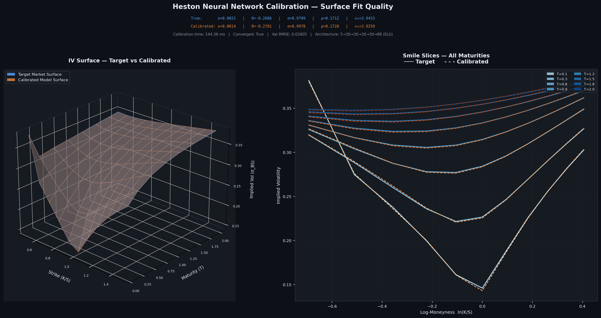

# Deep Learning Calibration of the Heston Stochastic Volatility Model 📈

[](https://pytorch.org/)
[](https://streamlit.io/)
[](https://python.org/)
[](https://opensource.org/licenses/MIT)

An end-to-end **neural network surrogate pipeline** for real-time calibration of the
Heston Stochastic Volatility Model, extended with epistemic uncertainty quantification
and LSTM-based temporal parameter dynamics.

Implements the methodology of *Horvath, Muguruza & Tomas (2019) "Deep Learning
Volatility"* with a modern PyTorch architecture, C² smooth ELU activations, strict
financial no-arbitrage constraints, Monte Carlo Dropout uncertainty estimation, and an
interactive Streamlit dashboard.

---

## Mathematical Foundation

### The Heston Model

$$dS_t = \mu S_t\,dt + \sqrt{v_t}\,S_t\,dW_t^S$$
$$dv_t = \kappa(\theta - v_t)\,dt + \sigma\sqrt{v_t}\,dW_t^v, \quad dW_t^S dW_t^v = \rho\,dt$$

| Parameter | Symbol | Meaning |
|---|---|---|
| Mean reversion speed | κ | How fast variance returns to θ |
| Long-run variance | θ | Steady-state variance |
| Vol of vol | σ | Volatility of the variance process |
| Correlation | ρ | Asset–variance correlation |
| Initial variance | v₀ | Variance at t = 0 |

### The Feller Condition

$$2\kappa\theta > \sigma^2$$

Ensures the variance process $v_t$ remains strictly positive. Enforced as a hard
penalty in the L-BFGS-B optimizer and checked at every LSTM inference step.

### Total Variance Representation

The network operates on Total Variance $W = \text{IV}^2 \times T$ rather than raw
implied volatility. This linearises the Dupire local-vol equation, improves numerical
stability, and produces a smoother objective for gradient-based calibration.

---

## System Architecture

The pipeline is structured as four independent phases, each building on the previous:

```text
Phase 1 — MLP Surrogate
  Parameters (5) ──[MinMaxScaler]──► MLP (5→30×4→88) ──[StandardScaler⁻¹]──► W surface (88)
                                                                                    │
Phase 2 — MC Dropout Uncertainty                                                    │
  model.train() + 100 forward passes ─────────────────────────────────► mean ± 2σ IV│
                                                                                    │
Phase 3 — LSTM Temporal Dynamics                                                    │
  10-day W sequence (10×88) ──► LSTM (2-layer, hidden=64) ──► next-day params (5)  │
                                                                                    │
Phase 4 — Professional UI & Architectural Visualization                             │
  Streamlit Tabs ──► Cytoscape.js (Network Graph) + KaTeX (Math Rendering)          │
```

### Phase 1: MLP Surrogate

```
Input(5) → [Linear → ELU → Dropout(0.1)] × 4 → Linear(30, 88)
```

| Property | Value |
|---|---|
| Hidden layers | 4 × 30 neurons |
| Activation | ELU (C² smooth — valid Hessian for gradient-based calibration) |
| Parameters | 5,698 |
| Input | 5 Heston params, MinMaxScaler → [−1, 1] |
| Output | 88-point W surface (8 maturities × 11 strikes), StandardScaler |
| Val RMSE | **0.0876** (in W-space) |
| Calibration time | **47–135 ms** (L-BFGS-B, CPU) |

**No-arbitrage constraints** enforced as soft L2 penalties during calibration:
- Calendar arbitrage: $\partial W/\partial T \geq 0$ (total variance non-decreasing — correct Carr–Madan condition)
- Butterfly arbitrage: $\partial^2 \text{IV}/\partial K^2 \geq 0$

### Phase 2: MC Dropout Uncertainty (Gal & Ghahramani, 2016)

Running $N=100$ stochastic forward passes with `model.train()` approximates the
posterior predictive distribution of the IV surface. The UI displays the mean surface
surrounded by ±2σ translucent bounds.

### Phase 3: LSTM Temporal Dynamics (Cont & Da Fonseca, 2002)

```
Input (B, 10, 88) → LSTM(hidden=64, layers=2) → LayerNorm → Linear(64, 5)
```

| Property | Value |
|---|---|
| Architecture | 2-layer LSTM, hidden=64, LayerNorm, forget-gate bias = 1 |
| Weight init | Xavier (input weights), Orthogonal (recurrent weights) |
| Parameters | 73,157 |
| Training data | 102,000 sequences (600 OU trajectories × 170 windows) |
| Test RMSE (normalized) | **0.355** |
| Per-param RMSE: v₀ | ≈ 0.0055 |
| Per-param RMSE: ρ | ≈ 0.0140 |
| Per-param RMSE: σ | ≈ 0.0271 |
| Per-param RMSE: θ | ≈ 0.0037 |
| Per-param RMSE: κ | ≈ 0.1340 |

The LSTM is trained on synthetic Ornstein–Uhlenbeck trajectories calibrated to
empirical SPX parameter dynamics (Cont & Da Fonseca, 2002; Bergomi, 2016). Inference
applies Z-score denormalization using the training-set label statistics, followed by
a hard clamp to the physical parameter bounds — ensuring every predicted parameter
vector satisfies the Feller condition and lies within the training domain.

### Phase 4: Professional UI & Architectural Visualization

A master's thesis-grade interactive Streamlit dashboard featuring:
- **Tabbed Modular Design:** Separates the interactive calibration pipeline from the mathematical methodology.
- **Interactive Cytoscape.js Network Graph:** Embeds a responsive computational graph mapping the exact data flow across all three Neural Network phases.
- **KaTeX Mathematical Popups:** Clicking on graph nodes reveals the underlying stochastic differential equations (SDEs), no-arbitrage constraints, and exact PyTorch code snippets used for implementation.
- **Monochrome Styling:** Enforces a strict, professional black-and-white theme suitable for academic presentation.

---

## Project Structure

```
derivatives/
├── README.md
├── setup_and_run.sh          # Linux: one-shot setup + full pipeline + UI
├── setup_and_run.bat         # Windows: one-shot setup + full pipeline + UI
├── build_all_tex.sh          # Linux: compile all LaTeX documents
├── build_all_tex.bat         # Windows: compile all LaTeX documents
│
├── src/                      # Pure Python source
│   ├── requirements.txt
│   ├── model.py              # HestonSurrogateMLP (Phase 1)
│   ├── data_loader.py        # Data pipeline + scaler persistence
│   ├── train.py              # MLP training loop
│   ├── calibrator.py         # L-BFGS-B + Feller + no-arbitrage + MC Dropout
│   ├── seq_model.py          # HestonDynamicsLSTM (Phase 3)
│   ├── train_seq.py          # LSTM training loop + HestonSequenceDataset
│   ├── benchmark_plots.py    # Publication-quality 3D surface plots
│   ├── greeks_autograd.py    # Jacobian + Hessian proof (C² vs ReLU)
│   └── app.py                # Streamlit interactive demo (all 3 phases)
│
├── scripts/
│   ├── generate_seq_data.py  # OU trajectory simulation → seq_dataset.npz
│   └── migrate_checkpoint.py # Key remapping for Phase 2 checkpoint upgrade
│
├── tests/
│   ├── test_phase2_uncertainty.py  # 7 tests: MC Dropout behaviour
│   └── test_phase3_lstm.py         # 22 tests: LSTM model, dataset, training
│
├── artifacts/                # Generated binaries (git-ignored)
│   ├── weights/
│   │   ├── heston_best.pth       # Phase 1: MLP surrogate checkpoint
│   │   └── heston_lstm_best.pth  # Phase 3: LSTM checkpoint
│   ├── scalers/
│   │   ├── feature_scaler.pkl    # MinMaxScaler for Heston parameters
│   │   ├── target_scaler.pkl     # StandardScaler for W surface
│   │   └── lstm_label_stats.npz  # Z-score stats for LSTM label normalisation
│   └── reports/
│
├── data/
│   ├── HestonTrainSet.txt.gz  # Horvath et al. original dataset
│   └── seq_dataset.npz        # LSTM sequence dataset (102,000 windows, 35 MB)
│
├── logs/                      # Runtime logs (git-ignored)
├── images/
│   └── generated/             # surface_fit.png and other output images
├── articles/                  # [READ-ONLY] Reference papers
└── tex/
    ├── literature_review/     # Master's thesis literature review
    └── presentation/          # Beamer defense presentation
```

---

## Quickstart

### Linux / macOS

**One command — handles everything:**
```bash
git clone <repo-url>
cd derivatives
bash setup_and_run.sh
```

This will:
1. Create `.venv/` and install all Python dependencies
2. Run the data pipeline (`data_loader.py`)
3. Train the MLP surrogate for 200 epochs (`train.py`)
4. Run a calibration smoke-test (`calibrator.py`)
5. Generate the LSTM sequence dataset (`scripts/generate_seq_data.py`)
6. Train the LSTM dynamics model for up to 200 epochs (`train_seq.py`)
7. Launch Streamlit at **http://localhost:8501**

**Skip all training** (use existing weights in `artifacts/`):
```bash
bash setup_and_run.sh --skip-train
```

**Skip LSTM training only** (re-run MLP pipeline but skip steps 5–6):
```bash
bash setup_and_run.sh --skip-lstm
```

### Windows

```bat
setup_and_run.bat
rem or
setup_and_run.bat --skip-train
rem or
setup_and_run.bat --skip-lstm
```

### Manual Setup

```bash
python3 -m venv .venv
source .venv/bin/activate          # Windows: .venv\Scripts\activate
pip install -r src/requirements.txt

# Phase 1: MLP surrogate
python src/data_loader.py
python src/train.py --epochs 200
python src/calibrator.py

# Phase 3: LSTM dynamics
python scripts/generate_seq_data.py
python src/train_seq.py --epochs 200

# Launch UI
streamlit run src/app.py
```

### Running Tests

```bash
python -m pytest tests/ -v
# Expected: 29 passed
```

---

## Compiling the LaTeX Documents

### Linux / macOS

```bash
# Install TeX Live (Arch Linux)
sudo pacman -S texlive-most

# Compile everything
bash build_all_tex.sh

# Or compile individually
bash tex/literature_review/build.sh
bash tex/presentation/build.sh
```

### Windows

```bat
REM Install MiKTeX: https://miktex.org/download
build_all_tex.bat
```

PDFs are placed next to their `.tex` source files. All compilation junk (`.aux`, `.log`,
`.toc`, etc.) goes to `tex/.latex_cache/`.

---

## Benchmark Results

### Phase 1: MLP Surrogate Calibration

| Metric | Value |
|---|---|
| Calibration time | **47–135 ms** (L-BFGS-B, CPU) |
| Val RMSE (W-space) | **0.0876** (retrained on W = IV² × T) |
| Surface grid | 8 maturities × 11 strikes = 88 points |
| Feller condition | Hard penalty — always satisfied post-calibration |
| Calendar arbitrage | Soft L2 penalty λ = 10⁻⁴ on ∂W/∂T violations (correct Carr–Madan) |
| Butterfly arbitrage | Soft L2 penalty λ = 10⁻⁴ on ∂²IV/∂K² violations |
| ELU Hessian ‖H‖_F | 1.039 (vs. ReLU: 0.000 — proves C² smoothness) |

### Phase 3: LSTM Temporal Dynamics

| Metric | Value |
|---|---|
| Training sequences | 102,000 (600 OU trajectories × 170 windows) |
| Test MSE (normalized) | **0.113** |
| Test RMSE (normalized) | **0.336** |
| v₀ RMSE (original scale) | ≈ 0.0052 |
| ρ RMSE (original scale) | ≈ 0.0133 |
| σ RMSE (original scale) | ≈ 0.0257 |
| θ RMSE (original scale) | ≈ 0.0035 |
| κ RMSE (original scale) | ≈ 0.1270 |



---

## Interactive UI Guide

Launch with `bash setup_and_run.sh --skip-train`, then open `http://localhost:8501`.

The dashboard is structured into two main tabs:

### Tab 1: Calibration Demo

| Section | How to Use |
|---|---|
| **Sidebar sliders** | Set κ, θ, σ, ρ, v₀ — Feller check updates live |
| **Generate Target Surface** | Runs the MLP forward pass; unlocks sections below |
| **Calibrate** | Runs L-BFGS-B; shows target vs. calibrated 3D IV surfaces + error table |
| **Estimate Uncertainty** | 100 MC Dropout passes; ±2σ translucent bounds on the IV surface |
| **Forecast Next-Day Parameters** | 10-day OU simulation → surrogate → LSTM → parameter trajectory chart + comparison table |

### Tab 2: Architecture & Methods

An academic reference interface detailing the model's inner workings. Features an interactive Cytoscape computational graph—click on any node (e.g., "Feller Barrier", "Calendar Arb", "LSTM Layer") to view the underlying mathematical formulas rendered in KaTeX and its corresponding codebase implementation.

---

## References

- Horvath, B., Muguruza, A. and Tomas, M. (2019). *Deep Learning Volatility*. SSRN 3322085.
- Cont, R. and Da Fonseca, J. (2002). *Dynamics of Implied Volatility Surfaces*. Quantitative Finance, 2(1), 45–60.
- Bergomi, L. (2016). *Stochastic Volatility Modeling*. CRC Press.
- Gal, Y. and Ghahramani, Z. (2016). *Dropout as a Bayesian Approximation*. ICML.
- Heston, S. L. (1993). *A Closed-Form Solution for Options with Stochastic Volatility*. Review of Financial Studies, 6(2), 327–343.
- Itkin, A. (2019). *Deep learning calibration of option pricing models: some pitfalls and solutions*.
